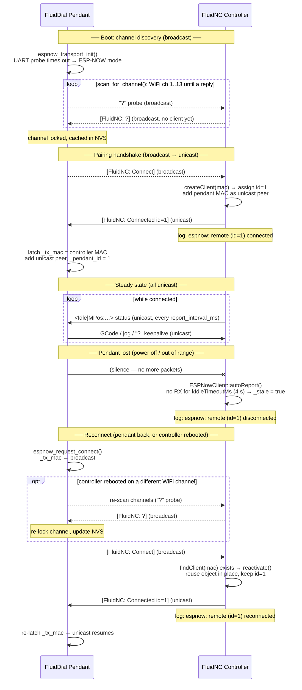

# ESP-NOW FluidDial Pendant Transport Layer

Connects a FluidDial M5Dial pendant to a FluidNC Controller (Only tested on V1E Jackpot v1) wirelessly
using ESP-NOW for a transport layer, with automatic wired/wireless detection at boot.
Potential to work with the CYD pendant and other FluidNC controllers.

This is an "either/or" with the WiFi/websocket functionality (they could be selectable if
there is enough space in memory).

(CYD support is wired up — a `cyd_base` plus `_espnow` profiles — but is untested beyond
compiling.)

## Terminology

- **Controller** — the FluidNC machine controller (the Jackpot). The only "controller".
- **Remote** — a pendant (FluidDial). FluidNC assigns each remote a unique numeric ID on
  connect (`id=1`, `id=2`, …).

## How it works

ESP-NOW supports two addressing modes that this project uses for different purposes:

- **Broadcast** (FF:FF:FF:FF:FF:FF) — fire-and-forget; any device on the same channel receives
  the frame. No acknowledgement, no retry. Used for channel discovery (`?` probe), the
  `[FluidNC: Connect]` handshake, and periodic status reports to display-only devices.
- **Unicast** (specific MAC) — the 802.11 layer automatically acknowledges every frame and
  retries on failure. Used for all GCode traffic once a remote connects. This makes the link
  substantially more reliable for jog and feed commands.

At startup FluidDial scans channels until FluidNC responds, then sends `[FluidNC: Connect]`.
FluidNC replies `[FluidNC: Connected id=N]`, both sides latch each other's MAC, and all
subsequent traffic switches to unicast. The broadcast status channel stays active so
display-only devices (no connection needed) keep receiving status updates.

## Pairing sequence
* See time sequence mermaid diagram at the bottom of this document.

## Hardware (as tested)
- **Controller**: FluidNC Controller running FluidNC v4.0.3 (tested on [V1E Jackpot](https://docs.v1e.com/electronics/jackpot/))
- **Pendant**: M5Dial (ESP32-S3) running FluidDial `m5dial_espnow` build

---
## Configure config.yaml
Add this to the FluidNC `config.yaml` alongside the uart_channel sections:
```yaml
espnow_channel:
  report_interval_ms: 100
```
`report_interval_ms` is the only setting — it sets how often FluidNC pushes a status report
to a connected remote. 100–200 ms gives a responsive UI. In ESP-NOW mode FluidDial does **not**
send `$RI=` — the YAML value is authoritative.

Also, if you have I2S_STATIC in your `config.yaml`, change to:
```yaml
stepping: 
  engine: I2S
```
(This is a change from the Portability branch)

---
## Architecture notes

### Wired vs Wireless detection (FluidDial side)
At boot, `espnow_transport_init()` in `ESPNowTransport.cpp` actively probes the UART: it sends
`?\n` and waits up to **1500 ms** for any response. If a byte arrives → stay in UART mode.
If timeout → switch to ESP-NOW mode. The active probe works whether FluidNC is freshly booted
or already running idle, because `?` always elicits a status report. Only one transport is
active at a time.

### FluidDial transport routing (`SystemArduino.cpp`)
`fnc_putchar()` / `fnc_getchar()` already route to UART or WebSocket. ESP-NOW is a third path,
selected when `USE_ESPNOW` is defined and `espnow_use_uart_mode()` returns false.

### `[FluidNC: ...]` protocol
A lightweight framing layer for connection management. Raw GCode bytes flow without framing
once connected.

| Frame | Direction | Meaning |
|-------|-----------|---------|
| `[FluidNC: Connect]` | Remote → FluidNC | Request a unicast channel |
| `[FluidNC: Connected id=N]` | FluidNC → Remote | Confirmed; remote ID N assigned, MAC latched for unicast |
| `[FluidNC: Busy]` | FluidNC → Remote | All 4 remote slots occupied |
| `[FluidNC: Disconnect]` | Remote → FluidNC | Release the slot (graceful disconnect; optional) |
| `[FluidNC: $report/interval=N]` | Remote → FluidNC | Set broadcast status interval (display mode) |
| `[FluidNC: <Idle\|...>]` | FluidNC → all | Periodic broadcast status (display mode) |
| `[FluidNC: ?]` | FluidNC → all | Reply to a `?` channel probe from an unconnected device |

### FluidNC side (`ESPNowServer` + `ESPNowClient` + `ESPNowBroadcastChannel`)
Split into classes following the TelnetServer/TelnetClient pattern:
- **`ESPNowServer`** (`Configurable`): owns radio init, broadcast peer setup, and static
  recv/send callbacks. Parses `[FluidNC: ...]` frames and manages up to 4 simultaneous remote
  slots. Init is deferred until **after** WiFi is up (after the Modules loop in `Main.cpp`)
  because `esp_now_init()` requires WiFi to be running.
- **`ESPNowClient`** (`Channel`): one instance per connected remote, keyed to that MAC and
  carrying its assigned ID. Created on the first `Connect`; **never deleted at runtime** — a
  reconnecting remote reuses its existing object via `reactivate()` (deleting a `Channel` from
  the ESP-NOW recv callback would race the main task's channel poll). TX is always unicast.
- **`ESPNowBroadcastChannel`** (`Channel`, internal to `ESPNowServer.cpp`): registered with
  `allChannels`; filters status lines starting with `<` and broadcasts them as `[FluidNC: <...>]`.
  Enables display-only devices with no connection required.

### Keepalive, disconnect detection, and the jog watchdog
The remote sends nothing periodically while merely connected, so FluidNC infers liveness from
remote traffic:

- **Idle disconnect detection** — `ESPNowClient::autoReport()` flags the client `_stale` and
  logs `espnow: remote (id=N) disconnected` if no packet arrives for `kIdleTimeoutMs` (4 s).
- **Ping** — FluidDial's `fnc_is_connected()` sends a `?` status request every
  `ping_interval_ms` (1500 ms) as a fallback keepalive. This must stay well below the 4 s
  idle timeout to avoid false-positive disconnects.
- **Jog watchdog** — a button-held continuous jog is a single long `$J=` command followed by
  radio silence, so FluidDial sends a `?` keepalive every 250 ms while the button is held
  (`MultiJogScene`). FluidNC's `ESPNowClient::pollLine()` — armed **only during `State::Jog`** —
  injects a `JogCancel` (0x85) if that keepalive stops for >500 ms, so a continuous jog can't
  run away after a remote drops mid-jog.

### Connection lifecycle (FluidNC log messages)
| Event | Log |
|-------|-----|
| Server ready | `espnow: server ready (broadcast status active; waiting for remotes)` |
| New remote connects | `espnow: remote (id=N) connected` |
| Remote reconnects (object reused) | `espnow: remote (id=N) reconnected` |
| Remote times out / sends Disconnect | `espnow: remote (id=N) disconnected` |
| All slots full | `espnow: rejected remote (slots full)` |

### WiFi channel discovery and reconnect
FluidNC can be on any 2.4 GHz channel. FluidDial finds it automatically:

1. **Channel scan** — steps through channels 1–13, sending a `?` probe on each. FluidNC
   replies `[FluidNC: ?]` confirming it is alive. Result cached in NVS for fast reboots.
2. **Connection** — sends `[FluidNC: Connect]`; FluidNC creates a unicast `ESPNowClient` and
   replies `[FluidNC: Connected id=N]`. FluidDial latches FluidNC's MAC and switches to unicast.

While disconnected, `espnow_request_connect()` runs every ~6 s: it first retries cheaply on
the current channel, and — throttled to once per 20 s — re-scans every channel. This handles a
controller reboot that brings FluidNC back on a **different** WiFi channel; without the
re-scan the remote would broadcast `Connect` on a dead channel forever.

### Multiple remotes
Up to 4 FluidDial (or other) remotes can connect simultaneously with no special configuration.
Each gets its own `ESPNowClient` slot and unique ID. A `Busy` reply is sent if all slots are
occupied.
- Both devices can send GCode; the FluidNC channel system arbitrates (no motion locking).
- Status responses are broadcast to all registered channels, so all remotes stay in sync.
- Each remote's jog watchdog fires independently of the others.

### Note on WebUI coexistence
- WebUI keeps working because ESP-NOW frames piggyback on the same radio at the same channel
  as the WiFi stack — they don't fight for it.
- If the WiFi channel changes (router roam, WebUI config, controller reboot), the link drops
  briefly; FluidDial's periodic re-scan re-acquires the new channel automatically.

## Primary files changed

### FluidDial
| File | Change |
|------|--------|
| `platformio.ini` | Added `m5dial_espnow` environment; excludes `WiFiConnection.cpp` |
| `src/ESPNowTransport.h` | Declares transport API |
| `src/ESPNowTransport.cpp` | Boot UART probe, TX buffer, RX ring buffer, ESP-NOW init; channel scan (`?` probe), `[FluidNC: Connect]` handshake, unicast MAC latch + remote-ID parse on `Connected`, reconnect with channel re-scan |
| `src/SystemArduino.cpp` | Routes `fnc_putchar/getchar` through ESP-NOW when in wireless mode |
| `src/HardwareM5Dial.cpp` | Calls `espnow_transport_init()` at startup |
| `src/FluidNCModel.cpp` | Calls `espnow_request_connect()` on disconnect; `ping_interval_ms` keepalive; skips `$RI=` in ESP-NOW mode |
| `src/MultiJogScene.cpp` | Sends a `?` keepalive every 250 ms during a button-held continuous jog |
| `src/Drawing.h` / `src/Drawing.cpp` | `drawESPNowIndicator()` — ESP-NOW status icon |
| `src/StatusScene.cpp` / `src/PieMenu.cpp` | Call `drawESPNowIndicator()` on round display |
| `src/BrightnessScene.cpp` | Falls back to `statusScene` when `USE_WIFI` not defined |

### FluidNC
| File | Change |
|------|--------|
| `FluidNC/src/ESPNowServer.h/.cpp` | Radio init, `[FluidNC: ...]` frame parsing, multi-remote management with unique IDs, `ESPNowBroadcastChannel` |
| `FluidNC/src/ESPNowClient.h/.cpp` | Channel: RX ring, unicast TX, idle-timeout disconnect detection, jog watchdog in `pollLine()`, `reactivate()` for in-place reconnect |
| `FluidNC/src/Machine/MachineConfig.h` | Added `ESPNowServer* _espnow_server` member |
| `FluidNC/src/Machine/MachineConfig.cpp` | Added `handler.section("espnow_channel", ...)` (YAML key unchanged) |
| `FluidNC/src/Main.cpp` | Calls `_espnow_server->init()` after Modules loop |

---

## Build Notes

### FluidDial
* Same as normal through the VS Code PlatformIO UI, just be sure to use the `m5dial_espnow`
  profile.
* Also build and upload the filesystem, which has a PNG icon for ESP-NOW mode.
* Manual way:
```
pio run -e m5dial_espnow
pio run -e m5dial_espnow -t upload
# for filesystem changes, or first time:
pio run -e m5dial_espnow -t buildfs
pio run -e m5dial_espnow -t uploadfs
```

### FluidNC
Build and flash normally for the Jackpot; add the `espnow_channel:` stanza and change I2S_STATIC to I2S for the engine in `config.yaml` (see above). 

### Time Sequence Diagrams

Solid arrows = **unicast** (802.11 ACK/retry); dashed arrows = **broadcast** (fire-and-forget).


